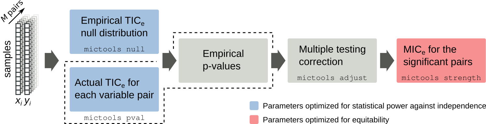

MICtools
========

.. image:: https://travis-ci.org/minepy/mictools.svg?branch=master
    :target: https://travis-ci.org/minepy/mictools

.. image:: https://badge.fury.io/py/mictools.svg
    :target: https://badge.fury.io/py/mictools

MICtools is an open source pipeline which combines the TIC_e and MIC_e measures
[Reshef2016]_ into a two-step procedure that allows to identify relationships of
various degrees of complexity in large datasets. TIC_e is used to perform 
an efficient high throughput screening of all the possible pairwise
relationships and a permutation based appraoch is used to assess their significance.  
MIC_e is then used to rank the subset of significant associations on the bases of their strength.

**Please cite**: Davide Albanese, Samantha Riccadonna, Claudio Donati, Pietro
Franceschi; A practical tool for Maximal Information Coefficient analysis, 
GigaScience, giy032, https://doi.org/10.1093/gigascience/giy032

The MICtools pipeline can be broken into 4 steps (see the figure above):

#. given M variables pairs x_i and y_i measured in n samples, the empirical
   TIC_e null distribution is estimated by permutation;
#. TIC_e statistics and the associated empirical p-values are computed for all 
   variable pairs;
#. p-values are corrected for multiplicity in order to control the family-wise
   error rate (FWER) or the false discovery rate (FDR);
#. finally, the strengths of the relationships called significant are estimated 
   using the MIC_e estimator.

**Table of contents**

.. contents:: :local:

Install
-------

Using pip (Linux and macOS/OS X)
^^^^^^^^^^^^^^^^^^^^^^^^^^^^^^^^

We suggest to install Python 3 (3.5+) and the GCC compiler through the package manager 
(In Mac OS X, we recommend to install them using `Homebrew <http://brew.sh/>`_)
(e.g. on Ubuntu/Debian):

.. code-block:: sh

    sudo apt-get update
    sudo apt-get install build-essential python3-dev

Then, upgrade pip and install setuptools:

.. code-block:: sh

    pip install --upgrade pip
    pip install 'setuptools >=14.0'

Finally, install mictools:

.. code-block:: sh

    pip install mictools

Docker (Linux, macOS/OS X and MS Windows)
^^^^^^^^^^^^^^^^^^^^^^^^^^^^^^^^^^^^^^^^^

#. Install Docker for `Linux <https://docs.docker.com/linux/>`_,
   `Mac OS X <https://docs.docker.com/mac/>`_ or
   `Windows <https://docs.docker.com/windows/>`_.

#. Run the ``Docker Quickstart Terminal`` (Mac OS X, Windows) or the
   ``docker`` daemon (Linux, ``sudo service docker start``).

#. Follow the instructions at https://hub.docker.com/r/minepy/mictools/.

From source
^^^^^^^^^^^

If you are installing from source, the following dependences must be installed:
Python >= 3.5, Click >= 5.1, numpy >= 1.7.0, scipy >= 0.13, pandas >= 0.17.0,
matplotlib >= 1.2.0,<2, statsmodels >= 0.6.1, minepy >= 1.2. We suggest to
install these dependences using the OS package manager (Linux), Homebrew 
(macOS/OS X) or pip.

Download the latest stable version from https://github.com/minepy/mictools/releases
and complete the installation:

.. code-block:: sh

   tar -zxvf mictools-X.Y.Z.tar.gz
   python3 setup.py install

Usage
-----

MICtools can be used to investigate variable associations in different types of experimental scenarios:

* single dataset X, with M variables and N samples: to evaluate
  the M+(M-1)/2 possible associations;
* two datasets, X (MxN) and Y (KxN) (parameter -y/--yvars): to evaluate 
  all the pairwise relationships between the variables of the two
  datasets (for a total of MxK associations). Note that the number samples (N)
  in the datasets X and Y must be the same.
* two datasets, X (MxN) and Y (KxN): to evaluate all the rowwise 
  relationships (see -r/--rowwise), i.e. only the variables pairs X_i and Y_i
  (for each i in min(M, K)) will be tested;
In all the abovementioned cases the analysis will be performed within each class independently if the sample classes are provided (see -l/--labels and -t/--target).

MICtools is implemented as a single command (``mictools'') with the following
subcommands:

``null``
  Compute the TIC_e null distribution.

``mergenull``
  Merge multiple TIC_e null distributions.

``pval``
  Compute TIC_e p-values.

``adjust``
  Multiple testing correction.

``strength``
  Compute the strength (MIC_e).

Run ``mictools SUBCOMMAND --help`` for the documentation of each specific step.

Tutorial
--------
We analyze the "Datasaurus" synthetic dataset generated following the approach discussed at  https://www.autodeskresearch.com/publications/samestats
([Matejka2017]_). The dataset contains 26 variables linked by 13 relationships
which have the same summary statistics (e.g. the Pearson's correlation),
but are very different in appearance. The dataset was modified in order to 
destroy secondary associations. In this example we test the entire set of possible 
associations (for a total of 26*(26-1)/2 = 325 relationships).

Preparation 
^^^^^^^^^^^
Go to the ``examples`` folder:

.. code-block:: sh

  cd examples

Select the Datasaurus dataset and the output folder:

.. code-block:: sh

  X=datasaurus.txt
  ODIR=datasaurus_results
  mkdir $ODIR

Empirical TIC_e null distribution
^^^^^^^^^^^^^^^^^^^^^^^^^^^^^^^^^
Compute the empirical TIC_e null distribution (with 200,000 permutations,
default value):

.. code-block:: sh

  mictools null $X $ODIR/null_dist.txt

The output file ``null_dist.txt`` is a TAB-delimited file which contains the 
null distrubution:

===== ======== ======== ========= ============
Class BinStart BinEnd   NullCount NullCountCum
===== ======== ======== ========= ============
None  0.000000 0.000100 0         200000
None  0.000100 0.000200 0         200000
None  0.000200 0.000300 0         200000
...   ...      ...      ...       ...
===== ======== ======== ========= ============

The first column (``Class``) contains the class membership (in this particular 
case no sample classes were provided), ``BinStart`` and ``BinEnd`` define the
TIC_e range and ``NullCount`` and ``NullCountCum`` are distribution and the 
cumulative distribution, respectively.

TIC_e p-values
^^^^^^^^^^^^^^
Compute the TIC_e statistics and the associated empirical p-values for all 
variable pairs:

.. code-block:: sh

  mictools pval $X $ODIR/null_dist.txt $ODIR

The command will return in the output directory the following:

``obs_dist.txt``
  the observed TICe distribution in the same format of ``null_dist.txt``
  
``obs.txt``
  TAB-delimited file containing the observed TICe values for each variable pair
  tested:

  ====== ========== ========
  Var1   Var2       None
  ====== ========== ========
  away_x bullseye_x	0.029476
  away_x circle_x   0.018211
  away_x dino_x     0.050720
  ...    ...        ...
  ====== ========== ========

``pval.txt``
  TAB-delimited file containing the empirical p-values for each variable pair

``pval_None.png``
  the p values distribution plot:

  .. image:: docs/images/pval_None.png

Multiple testing correction
^^^^^^^^^^^^^^^^^^^^^^^^^^^
Correct the p-values for multiplicity in order to control the false discovery
rate (FDR, default method);

.. code-block:: sh

  mictools adjust $ODIR/pval.txt $ODIR

The command returns in the OUTPUT directory the following files: 

``pval_adj.txt`` 
  adjusted p values for each variable pair tested, in the same format of 
  ``pval.txt``

``pi0_None.png``
  since the correction method is the Storey's qvalue, the command returns
  a plot with the estimated pi_0 versus the tuning parameter lambda:

  .. image:: docs/images/pi0_None.png

Strength of significant associations
^^^^^^^^^^^^^^^^^^^^^^^^^^^^^^^^^^^^
Finally, the strengths of the relationships called significant are estimated 
using MIC_e. By default the significance level is set to 0.05:

.. code-block:: sh

  mictools strength $X $ODIR/pval_adj.txt $ODIR/strength.txt

The output file ``strength.txt`` is a TAB-delimited file, containing for each 
significant association the (corrected) TIC_e p-values, the Pearson's
correlations, the Spearman's coefficients and finally the strengths, *i.e.* the
MIC_e values:

===== ========== ========== ============ ========= =========== ========
Class Var1       Var2       TICePVal     PearsonR  SpearmanRho MICe
===== ========== ========== ============ ========= =========== ========
None  bullseye_x bullseye_y 3.833704e-02 -0.068586 -0.078734   0.424553
None  circle_x   circle_y   4.723013e-04 -0.068343 -0.077292   0.631458
None  dots_x     dots_y     1.983666e-02 -0.060342 -0.126174   0.500185
None  slant_up_x slant_up_y 1.593666e-02 -0.068609 -0.086098   0.355019
None  star_x     star_y     4.723013e-04 -0.062961 -0.051445   0.633117
None  x_shape_x  x_shape_y  4.723013e-04 -0.065583 -0.020535   0.566703
===== ========== ========== ============ ========= =========== ========

.. [Reshef2016] Yakir A. Reshef, David N. Reshef, Hilary K. Finucane and 
                Pardis C. Sabeti and Michael Mitzenmacher. Measuring Dependence
                Powerfully and Equitably. Journal of Machine Learning Research, 
                2016.
.. [Matejka2017] J. Matejka and G. Fitzmaurice. Same Stats, Different Graphs: 
                 Generating Datasets with Varied Appearance and 
                 Identical Statistics through Simulated Annealing. 
                 ACM SIGCHI Conference on Human Factors in Computing Systems, 2017.
